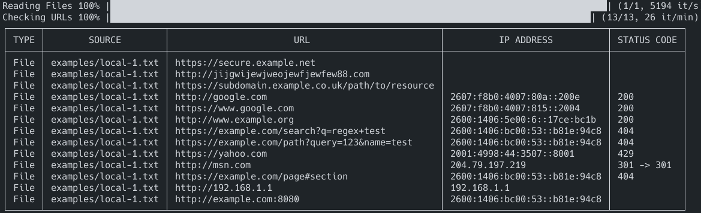

**url-finder**

- [About](#about)
- [Usage](#usage)
  - [Installation](#installation)
    - [Linux](#linux)
    - [Windows](#windows)
  - [Run](#run)

---

# About

`url-finder` can be used to probe HTTP(s) URLs on web pages or local files, searching for dead links or redirects.

It will report the URL it found, and IP Address and HTTP response codes if relevant.

**This was mostly "vibe-coded".**

Example:



---

Type | Source    | URL                 | IP Address | Status Code
-----|-----------|---------------------|------------|------------
File | File Name | https://example.com | 1.1.1.1    | 404

# Usage

```
Usage: url-finder [--log-format LOG-FORMAT] [--log-level LOG-LEVEL] [--log-colors] [--columns COLUMNS] [--file-extensions FILE-EXTENSIONS] [--no-query] [--query-threads QUERY-THREADS] [--show-all] [--user-agent USER-AGENT] TARGET

Positional arguments:
  TARGET                 Path to url-finder config file or URL

Options:
  --log-format LOG-FORMAT
                         Set log format: plain or JSON [default: plain]
  --log-level LOG-LEVEL, -l LOG-LEVEL
                         Set log level: INFO, DEBUG, ERROR, WARNING [default: INFO]
  --log-colors           Enables color in the log output [default: true]
  --columns COLUMNS      Columns to display in the output [default: type,URL,IPAddress,StatusCode,ResponseTime]
  --file-extensions FILE-EXTENSIONS
                         Comma-separated list of file extensions to parse [default: .md,.markdown,.txt,.text,.log,.cfg,.conf,.ini,.json,.yaml,.yml,.xml,.html,.htm]
  --no-query             Disable querying URLs
  --query-threads QUERY-THREADS
                         Number of concurrent threads to use for querying URLs [default: 3]
  --show-all             Show all results, or only failed URLs [default: false]
  --user-agent USER-AGENT
                         Set the User-Agent header for the HTTP request [default: url-finder/1.0]
  --help, -h             display this help and exit
  --version              display version and exit
```

## Installation

### Linux

```bash
curl -L "https://github.com/DaemonDude23/url-finder/releases/download/v0.1.0/url-finder_0.1.0_linux_amd64.tar.gz" -o url-finder.tar.gz && \
tar -xzf url-finder.tar.gz url-finder && \
sudo mv url-finder /usr/local/bin/ && \
rm url-finder.tar.gz && \
sudo chmod +x /usr/local/bin/url-finder
```

### Windows

1. Download the Windows version.
2. Untar it and put it in your `$PATH`.

## Run

```bash
url-finder ./examples/resources/url-finder.yaml
```

```bash
url-finder https://blog.andrewaadland.me/
```
